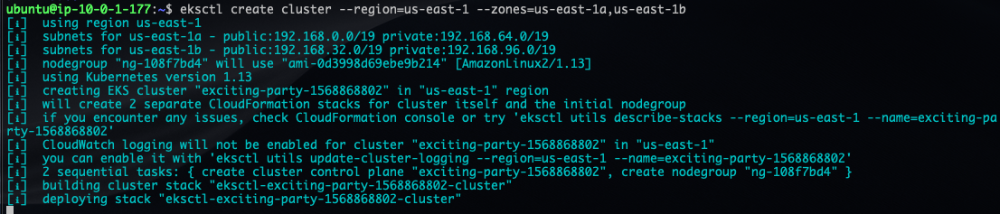
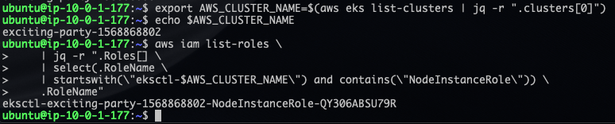
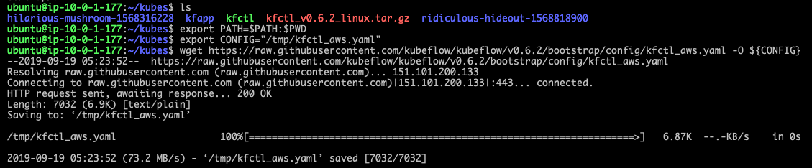

# Backend Infrastructure

## Overview

This repository contains infrastructure code to set up KubeFlow on AWS EKS (Elastic Kubernetes Service). 
It requires several dependencies:

* an appropriate `awscli` profile configured using the public/private access keys
* a Databricks account provisioned, along with an active API key that must be generated via the Databricks UI.

## Modules

### Databricks

Databricks requires a special VPC set up for its clusters to run inside. 

## Terraform

Terraform is used to provision many of the underlying infrastructure, including the

* core OperatorFlow VPC
* bastion host EC2 instance
* route tables and subnet CIDR blocks
* Databricks subnet
* IAM (Identity Access Management) roles for Databricks to provision Apache Spark EC2 instances
* S3 buckets to store Databricks metadata

### Steps to Replicate

#### Provisioning Infrastructure via Terraform

1. Make sure you are in the `infrastructure/` folder.
2. Run `terraform init` to initialize Terraform locally.
3. Run `terraform plan` to fetch remote state from AWS and compare against the local Terraform state.
4. Run `terraform apply` to apply the changes and create the necessary infrastructure. 

#### Provisioning AWS EKS Cluster via `eksctl`

1. Make sure that the instance you are running `eksctl` on has been properly configured via `awscli`. If it has not, run `aws configure`.
2. Run 
```shell script
eksctl create cluster --node-type="m5.xlarge" --nodes-min=1 --nodes-max=3 --region=us-east-1 --zones=us-east-1a,us-east-1b
```
to provision the EKS cluster in the `us-east-1` region. Note that
you should make sure to properly define the regions and availability zones, since not all availability zones of each region are capable
of supporting a large enough instance type as required by KubeFlow and Istio.
3. Wait a few minutes for the provisioning to finish, and then grab the cluster name.

During the provisioning process, your terminal output will look like this:


4. Run the following command to save the cluster name as an environment variable:
```shell script
export AWS_CLUSTER_NAME=<AWS_CLUSTER_NAME>
```
5. Find the appropriate node instance role by using
```shell script
export AWS_NODE_INSTANCE_ROLE=$(aws iam list-roles \
    | jq -r ".Roles[] \
    | select(.RoleName \
    | startswith(\"eksctl-$AWS_CLUSTER_NAME\") and contains(\"NodeInstanceRole\")) \
    .RoleName")
```
This will allow you to later edit the KubeFlow configuration files:


#### Provisioning KubeFlow and Istio

In order to provision KubeFlow, you'll need to first make sure that you download the correct `kfctl` golang binary:

1. From the KubeFlow installation documentation:
```shell script
# Add kfctl to PATH, to make the kfctl binary easier to use.
tar -xvf kfctl_<release tag>_<platform>.tar.gz
export PATH=$PATH:"<path to kfctl>"
```
2. Then download the configuration YAML file:
```shell script
# Download config file
export CONFIG="/tmp/kfctl_aws.yaml"
wget https://raw.githubusercontent.com/kubeflow/kubeflow/v0.6.2/bootstrap/config/kfctl_aws.yaml -O ${CONFIG}
```


3. Save the `KFAPP` environment variable as your cluster name:
```shell script
export KFAPP=${AWS_CLUSTER_NAME}
echo $KFAPP
```
4. Change the role in the `kfctl_aws.yaml` configuration to the node instance role:
```shell script
sed -i "s/eksctl-kubeflow-aws-nodegroup-ng-a2-NodeInstanceRole-xxxxxxx/$AWS_NODE_INSTANCE_ROLE/" /tmp/kfctl_aws.yaml
sed -i "s/us-west-2/us-east-1/" /tmp/kfctl_aws.yaml
```
*Note*: Because of a recent merge into the KubeFlow repo, you'll need to also replace the manifest with the master manifest branch:
```shell script
sed -i 's/manifests\/archive\/v[0-1]\.[0-9]-branch\.tar\.gz/manifests\/archive\/master\.tar\.gz/' /tmp/kfctl_aws.yaml
```

5. Then, initialize the cluster configurations and enter the cluster directory:
```shell script
kfctl init ${KFAPP} --config=${CONFIG} -V
cd ${KFAPP}
```
6. Now, you can use the template in `app.yaml` to generate the other manifest YAML files for your Istio deployment and Kubeflow objects:
```shell script
kfctl generate all -V
```
This will generate all the Kustomize configuration files that are needed.
7. You can apply the changes to the Kubernetes controller via
```shell script
kfctl apply all -V
```

### Bastion Host

OperatorFlow's infrastructure is provisioned via a **bastion host** that is set up in its own separate VPC 
(virtual private cloud). The files in the `infrastructure` folder provide the Terraform resources necessary for provisioning the
networking and EC2 instance that the bastion host uses. The bastion host EC2 instance uses a default AWS AMI (machine image) that already
contains necessary configurations and packages (`awscli`, `boto3`, etc.).

### API Gateway SDK

An auto-generated API Gateway Javascript SDK is available inside the `api_gateway` folder. This SDK can be used within any frontend Javascript
client to quickly make calls to the API Gateway and fetch resources from Databricks.